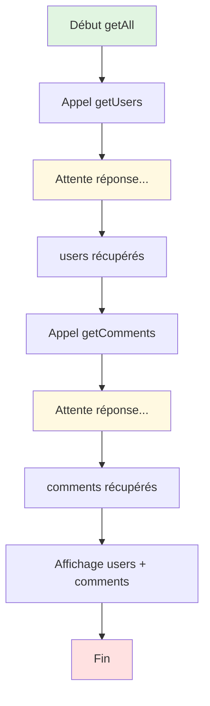
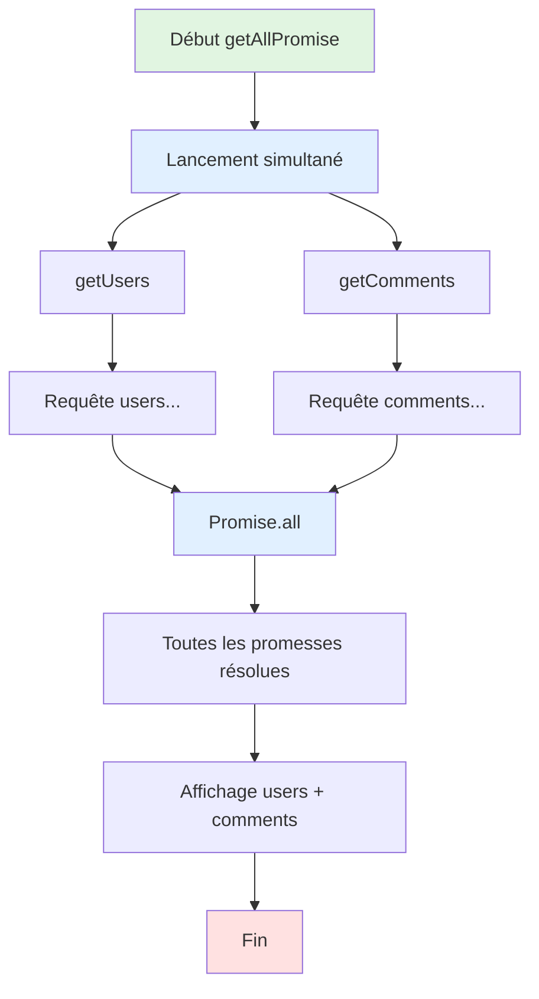

# Jour-Demo

## Description

Ce projet te montre comment utiliser l'API Fetch en JavaScript pour récupérer des données depuis une API externe (JSONPlaceholder). Tu y découvriras deux approches différentes :

- **Exécution en série** : Les requêtes sont effectuées l'une après l'autre (plus lent)
- **Exécution en parallèle** : Les requêtes sont lancées simultanément avec `Promise.all` (plus rapide)

## Fonctionnalités

- Récupération des utilisateurs depuis l'API JSONPlaceholder
- Récupération des commentaires depuis l'API JSONPlaceholder
- Affichage des données dans la console et sur la page HTML
- Comparaison des performances entre exécution série et parallèle

##  Schéma : Exécution en série (getAll)

Dans ce mode, chaque requête attend que la précédente soit terminée avant de démarrer.

## Schéma : Exécution en parallèle (getAllPromise)

Dans ce mode, les deux requêtes sont lancées en même temps, ce qui réduit le temps total d'exécution.

## Technologies utilisées

- HTML5
- JavaScript (ES6+)
- API Fetch
- Promises & async/await
- JSONPlaceholder API